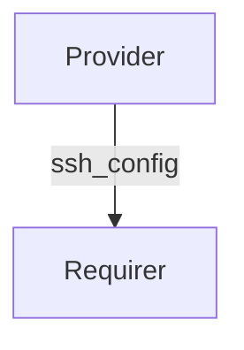

# `charmed-openssh-ssh-config-interface`


## Usage

The `ssh_config` interface enables charms to provide custom OpenSSH server
configuration to a subordinate charm such as the `openssh` operator. A provider
- for example, like the SSSD charm that needs the SSH daemon to query an LDAP server
for user public keys - sends configuration snippets that the requirer writes
into `/etc/ssh/ssh_config.d/`.

To install, add `charmed-openssh-ssh-config-interface` to your Python
dependencies.  Then in your Python code, import as:

```python
from charmed_openssh_ssh_config_interface import (
    SSHConfigConnectedEvent,
    SSHConfigData,
    SSHConfigDisconnectedEvent,
    SSHConfigProvider,
    SSHConfigReadyEvent,
    SSHConfigRequirer,
)
```

## Direction

The `ssh_config` interface implements a provider/requirer pattern.
The Provider supplies custom SSH daemon configuration through the integration
application databag.
The Requirer consumes that configuration and applies it to the local SSH
daemon.



## Behavior

### Provider

- Emits `ssh_config_connected` when a requirer joins the integration.
- Sets the `ssh_config` key in the application databag via `set_config_data`.
- Only writes data when the unit is the application leader.
- Uses `set_config_data` to serialize an `SSHConfigData` object into the
  application databag.

### Requirer

- Observes `relation_changed` and emits `ssh_config_ready` when the
  provider's application databag contains the required `ssh_config` field.
- Observes `relation_broken` and emits `ssh_config_disconnected` when
  the provider application departs.
- Calls `get_config_data` to deserialize the `SSHConfigData` object from the
  integration databag.

## Integration data

A single field, `ssh_config`, is exchanged through the integration's application
databag.  No data flows in the reverse direction and no Juju Secrets are used.

### Example

```yaml
provider:
  app:
    ssh_config: "AuthorizedKeysCommand /usr/bin/sss_ssh_authorizedkeys"
  unit: {}
requirer:
  app: {}
  unit: {}
```

## Examples

### Provider charm

```python
import ops
from charmed_openssh_ssh_config_interface import (
    SSHConfigConnectedEvent,
    SSHConfigData,
    SSHConfigProvider,
)


class ExampleProviderCharm(ops.CharmBase):
    """Charm that provides SSH daemon configuration."""

    def __init__(self, framework: ops.Framework) -> None:
        super().__init__(framework)
        self._ssh_config = SSHConfigProvider(self, "ssh-config")
        framework.observe(
            self._ssh_config.on.ssh_config_connected,
            self._on_ssh_config_connected,
        )

    def _on_ssh_config_connected(self, event: SSHConfigConnectedEvent) -> None:
        data = SSHConfigData(
            ssh_config="AuthorizedKeysCommand /usr/bin/sss_ssh_authorizedkeys\n"
        )
        self._ssh_config.set_config_data(data, integration_id=event.relation.id)
```

### Requirer charm

```python
import ops
from charmed_openssh_ssh_config_interface import (
    SSHConfigData,
    SSHConfigReadyEvent,
    SSHConfigRequirer,
)


class ExampleRequirerCharm(ops.CharmBase):
    """Charm that consumes SSH daemon configuration."""

    def __init__(self, framework: ops.Framework) -> None:
        super().__init__(framework)
        self._ssh_config = SSHConfigRequirer(self, "ssh-config")
        framework.observe(
            self._ssh_config.on.ssh_config_ready,
            self._on_ssh_config_ready,
        )

    def _on_ssh_config_ready(self, event: SSHConfigReadyEvent) -> None:
        data = self._ssh_config.get_config_data(event.relation.id)
        if data is not None:
            # Write `data.ssh_config` to `/etc/ssh/ssh_config.d/` and
            # reload the SSH daemon.
            self.unit.status = ops.ActiveStatus()
```
